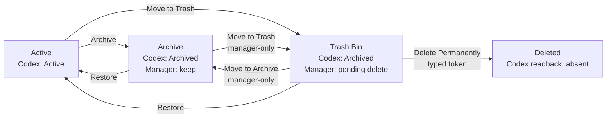

# Agent Session Manager

Agent Session Manager 是一個 macOS 原生 App，替 Codex 補上一個安全、可批量操作的 session 管理層。

Codex 有 Active 與 Archive，但沒有垃圾桶。當 session 變多時，也沒有方便的批量 Archive、Restore
或刪除流程。更麻煩的是，「我想長期保留」和「我之後想刪掉」在 Codex 裡都只會呈現 Archived，意圖
無法區分。

這個 App 因此把兩件事分開：

- **Archive**：刻意保留的 session。
- **Trash Bin**：已收起、等待之後永久刪除的 session。

> [!WARNING]
> 目前是 Apple Silicon 的 Alpha 測試版，採 ad-hoc signing，尚未經 Apple notarization。執行永久刪除前，
> 請先備份重要 Codex sessions。

## 它如何運作



Archive 和 Trash Bin 在 Codex 原生狀態中都仍是 Archived。App 自己的 SQLite 只記錄「保留」或
「待刪」的管理意圖與操作報告；Codex 的實際 lifecycle 狀態仍以官方 App Server 的即時 inventory
與 readback 為準。

App 不會直接修改 Codex 的 JSONL、SQLite、cache 或 session 檔案。Archive、Restore 與 Delete
都透過 Codex 支援的官方 lifecycle interface 執行。

## 目前能做什麼

- 瀏覽 Codex Live sessions，依狀態、Project、Trust Folder 或 Working Folder 篩選。
- 使用 checkbox 精確多選並批量 Archive、Restore、移入／移出 Trash Bin。
- 只在 Trash Bin 提供 **Select all filtered**；其他分類不提供一鍵全選，降低誤操作範圍。
- 從 Trash Bin 批量永久刪除；Archive 不能直接刪除，必須先移到 Trash Bin。
- 顯示 pinned、running、current 與 descendant protection evidence；不把 unknown 假裝成 clear，並依
  每種操作的安全規則決定是否允許執行。
- 保存逐筆 Report History 與隱私過濾後的 Diagnostic Logs。
- 記住 sidebar、inspector 與 session table 欄寬。

目前只支援 **Codex Live**。Provider 架構保留給未來的 Claude 或其他 agent systems，但不假設它們
具有和 Codex 相同的 archive／delete semantics。

## 安全模型

每次 mutation 都遵循同一條路徑：

```text
Exact selection → Frozen Preview → Confirm → Execute once → Fresh readback → Itemized Report
```

- Preview 後 inventory 或 protection evidence 漂移，整批 fail closed。
- Provider 回傳 failure 或 unknown 時停止 batch；不會縮小選取範圍後偷偷繼續，也不會自動重送。
- 可逆操作只需要 review Preview 並按下 Confirm。
- Permanent Delete、清除 Report History 等不可逆操作才要求輸入 exact confirmation token。
- Permanent Delete 只接受 Manager Trash Bin 中的 session，並以 fresh readback 證明已不存在。

更完整的規則見 [Safety](docs/SAFETY.md) 與 [Architecture](docs/ARCHITECTURE.md)。

## 下載與安裝

前往 [Releases](https://github.com/xLuSean/agent_session_manager/releases) 下載目前的 Apple Silicon DMG
及同名 `.sha256`，然後驗證：

```bash
shasum -a 256 -c Agent-Session-Manager-0.1.3-alpha.1-arm64.dmg.sha256
```

開啟 DMG，將 `AgentSessionManager.app` 拖到 Applications。由於目前版本尚未 notarize，macOS
Gatekeeper 可能阻止一般啟動；若無法開啟，可先改用下方的 Xcode 開發方式。

需求：macOS 14 或更新版本、Apple Silicon，以及本機可用的 Codex CLI／App Server。

## 開發與驗證

用 Xcode 開啟：

```bash
open macos/AgentSessionManager/App/AgentSessionManager/AgentSessionManager.xcodeproj
```

選擇 shared `AgentSessionManager` scheme 與 `My Mac`，然後 Run。Shipping App 直接進入 Codex Live；
Fixture 只存在獨立 test-support target，不會被連結進正式 App。

執行不會送出 live lifecycle mutation 的本機驗證：

```bash
./scripts/verify.sh
```

建立與目前 `v0.1.3-alpha.1` release 一致的 DMG：

```bash
./scripts/package_dmg.sh
```

輸出位於 `dist/Agent-Session-Manager-0.1.3-alpha.1-<architecture>.dmg`。下一個 pre-release 可用
`RELEASE_SUFFIX_OVERRIDE=alpha.2` 覆寫；正式版則使用空 suffix。完整流程與 signing／notarization 門檻
見 [Packaging](docs/PACKAGING.md)。

## 本機資料

Manager-owned SQLite 與診斷記錄位於：

```text
~/Library/Application Support/com.sean.AgentSessionManager/
```

這些資料用來保存 Trash／Archive 意圖、Preview、Report History 與 bounded diagnostic logs，不取代
Codex 的 session storage，也不是 mutation 成功的判定來源。

## 專案狀態

目前版本已接上 Codex Live 的單筆與 checkbox batch Archive、Restore、Active ↔ Trash，以及
Trash → Deleted。這仍是 Alpha：公開 DMG 尚未 Developer ID sign／notarize，也尚未完成 clean-Mac
發佈驗收。詳細進度見 [Roadmap](docs/ROADMAP.md) 與 [TODO](docs/TODO.md)。

## Security 與 License

請勿在公開 Issue 貼出未遮罩的 session ID、專案名稱、本機路徑、SQLite、JSONL 或 diagnostic logs。
漏洞回報方式見 [SECURITY.md](SECURITY.md)。

本專案採 [Apache License 2.0](LICENSE)，作者與 attribution 資訊見 [NOTICE](NOTICE)。

## 延伸文件

- [Architecture](docs/ARCHITECTURE.md)
- [Safety model](docs/SAFETY.md)
- [Packaging and distribution](docs/PACKAGING.md)
- [App Server compatibility](docs/APP_SERVER_COMPATIBILITY.md)
- [SQLite schema](docs/SQLITE_SCHEMA.md)
