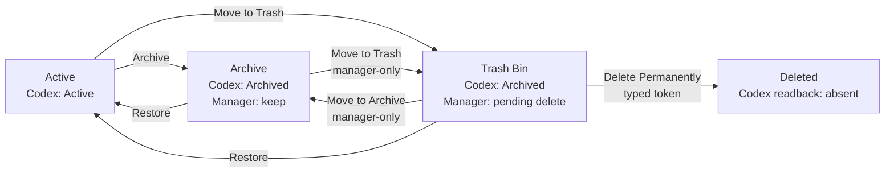

# Agent Session Manager

**English** | [繁體中文](README.zh-TW.md)

Agent Session Manager is a native macOS app that adds a safe, batch-capable session management layer to Codex.

Codex provides Active and Archive states, but it has no trash bin. As the session library grows, there is also no
convenient way to archive, restore, or delete sessions in batches. More importantly, sessions you want to keep and
sessions you intend to delete later both appear as Archived in Codex, so those two intentions cannot be distinguished.

This app separates them:

- **Archive**: sessions intentionally retained for long-term storage.
- **Trash Bin**: sessions set aside for possible permanent deletion.

> [!WARNING]
> This is an Apple Silicon alpha build. It is ad-hoc signed and has not been notarized by Apple. Back up important
> Codex sessions before using permanent deletion.

## How it works



Archive and Trash Bin both remain Archived in Codex's native state. The app's own SQLite database records only the
management intent—keep or pending deletion—and operation reports. Codex lifecycle state remains authoritative through
fresh inventory and readback from the official App Server.

The app never directly modifies Codex JSONL, SQLite, cache, or session files. Archive, Restore, and Delete operations
use lifecycle interfaces supported by Codex.

## Current features

- Browse Codex Live sessions and filter by status, Project, Trust Folder, or Working Folder.
- Use checkboxes for exact multi-selection and batch Archive, Restore, and Trash Bin operations.
- Use **Select all filtered** only inside Trash Bin; other collections intentionally have no one-click select-all.
- Permanently delete sessions in batches from Trash Bin. Archive cannot be deleted directly; it must first move to Trash.
- Display pinned, running, current, and descendant protection evidence without presenting unknown evidence as clear.
- Retain itemized Report History and privacy-filtered Diagnostic Logs.
- Restore sidebar, inspector, and session-table column widths between launches.

Only **Codex Live** is currently supported. The provider architecture leaves room for Claude and other agent systems,
without assuming that their archive or delete semantics match Codex.

## Safety model

Every mutation follows the same path:

```text
Exact selection → Frozen Preview → Confirm → Execute once → Fresh readback → Itemized Report
```

- If inventory or protection evidence drifts after Preview, the entire batch fails closed.
- A failure or unknown result stops the batch. The app never silently narrows the selection or retries automatically.
- Reversible actions require reviewing the Preview and pressing Confirm.
- Only irreversible actions, such as Permanent Delete or clearing Report History, require an exact confirmation token.
- Permanent Delete accepts only sessions in the Manager Trash Bin and requires fresh readback proving absence.

See [Safety](docs/SAFETY.md) and [Architecture](docs/ARCHITECTURE.md) for the full model.

## Download and install

Download the current Apple Silicon DMG and its matching `.sha256` file from
[Releases](https://github.com/xLuSean/agent_session_manager/releases), then verify it:

```bash
shasum -a 256 -c Agent-Session-Manager-0.1.3-alpha.1-arm64.dmg.sha256
```

Open the DMG and drag `AgentSessionManager.app` into Applications. Because this build is not notarized, macOS
Gatekeeper may block normal launching. If it cannot be opened, use the Xcode development workflow below instead.

Requirements: macOS 14 or later, Apple Silicon, and a locally available Codex CLI/App Server.

## Development and verification

Open the Xcode project:

```bash
open macos/AgentSessionManager/App/AgentSessionManager/AgentSessionManager.xcodeproj
```

Select the shared `AgentSessionManager` scheme and `My Mac`, then Run. The shipping app starts directly in Codex Live.
Fixture support exists only in a separate test-support target and is not linked into the shipping app.

Run the local verification suite without sending live lifecycle mutations:

```bash
./scripts/verify.sh
```

Build a DMG matching the current `v0.1.3-alpha.1` release:

```bash
./scripts/package_dmg.sh
```

The result is written to `dist/Agent-Session-Manager-0.1.3-alpha.1-<architecture>.dmg`. Use
`RELEASE_SUFFIX_OVERRIDE=alpha.2` for the next pre-release, or an empty suffix for a stable release. See
[Packaging](docs/PACKAGING.md) for the complete process and signing/notarization requirements.

## Local data

Manager-owned SQLite state and diagnostic logs are stored under:

```text
~/Library/Application Support/com.sean.AgentSessionManager/
```

This data records Archive/Trash intent, Previews, Report History, and bounded diagnostic events. It does not replace
Codex session storage and is not the authority for deciding whether a lifecycle mutation succeeded.

## Project status

The current build supports single-session and checkbox batch Archive, Restore, Active ↔ Trash, and Trash → Deleted
operations against Codex Live. It is still alpha software: the public DMG is not Developer ID signed or notarized, and
clean-Mac distribution acceptance remains incomplete. See the [Roadmap](docs/ROADMAP.md) and [TODO](docs/TODO.md).

## Security and license

Do not post unredacted session IDs, project names, local paths, SQLite files, JSONL files, or diagnostic logs in public
issues. See [SECURITY.md](SECURITY.md) for vulnerability reporting instructions.

This project is licensed under the [Apache License 2.0](LICENSE). Author and attribution information is available in
[NOTICE](NOTICE).

## Additional documentation

- [Architecture](docs/ARCHITECTURE.md)
- [Safety model](docs/SAFETY.md)
- [Packaging and distribution](docs/PACKAGING.md)
- [App Server compatibility](docs/APP_SERVER_COMPATIBILITY.md)
- [SQLite schema](docs/SQLITE_SCHEMA.md)
