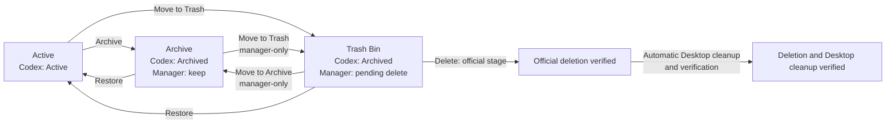
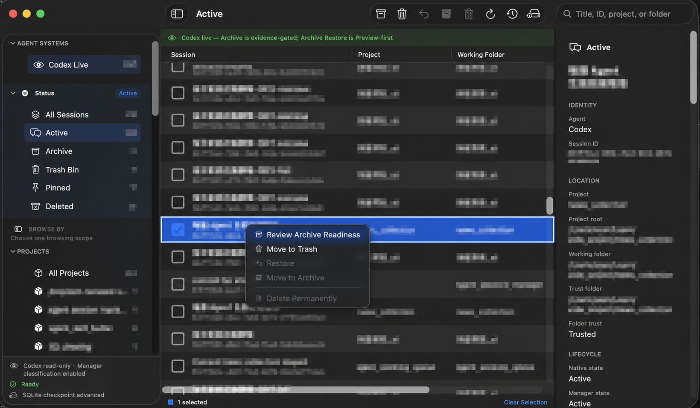
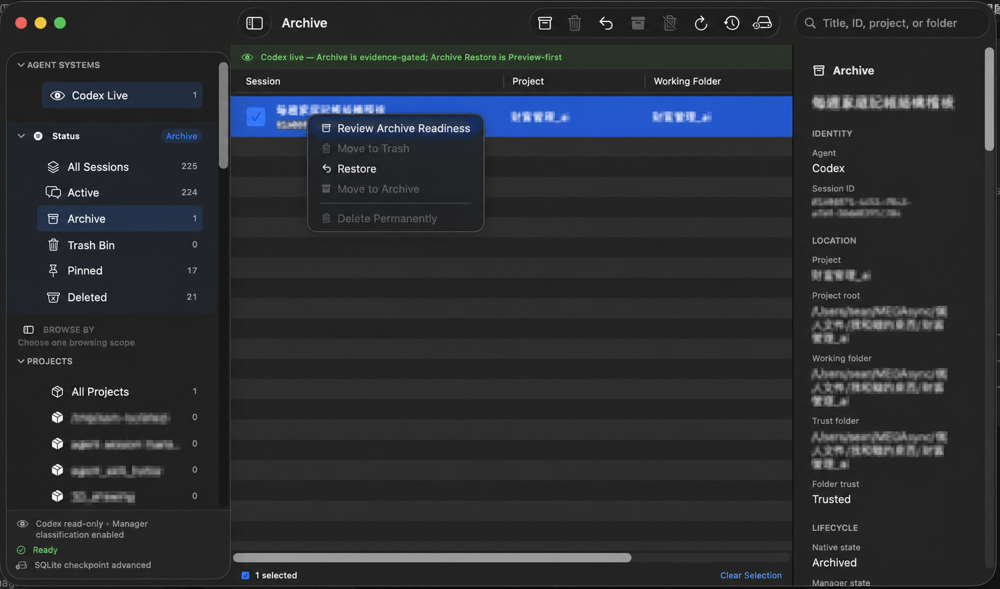
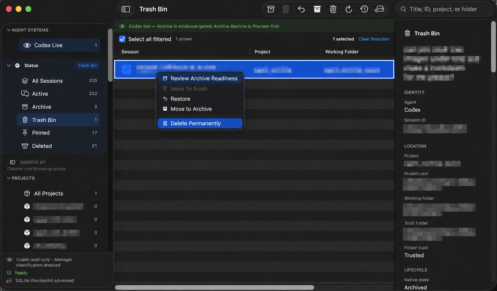

# Agent Session Manager

**English** | [繁體中文](README.zh-TW.md)

Agent Session Manager is a native macOS app that adds a safe, batch-capable session management layer to Codex.

Codex provides Active and Archive states, but it has no trash bin. As the session library grows, there is also no
convenient way to archive, restore, or delete sessions in batches. More importantly, sessions you want to keep and
sessions you intend to delete later both appear as Archived in Codex, so those two intentions cannot be distinguished.

This app separates them:

- **Archive**: sessions intentionally retained for long-term storage.
- **Trash Bin**: sessions set aside for possible permanent deletion.

> [!WARNING]
> This is an Apple Silicon alpha build. It is ad-hoc signed and has not been notarized by Apple. Back up important
> Codex sessions. Integrated Delete and Desktop cleanup have passed small-batch local acceptance, not every batch
> size or future Codex version. Check the final cleanup result; official deletion alone is not complete cleanup.

## How it works

Compatibility preview build 16 adds local Codex update detection, explicit change reminders, a 15-environment cache,
and isolated CLI compatibility tests. It does **not** yet automatically admit unknown Desktop versions for residue
cleanup. Keep the existing Codex version until you complete the before-update check; follow the short
[update test guide](docs/USER_GUIDE.md#build-16更新前後的精簡驗收). No real session deletion is needed for this test.

Build 18 adds visible test progress, clearly labeled previous results during verification, and per-check
Compatibility diagnostics in Settings → Logs. It does not change the cleanup admission rules.



Archive and Trash Bin both remain Archived in Codex's native state. The app's own SQLite database records only the
management intent—keep or pending deletion—and operation reports. Codex lifecycle state remains authoritative through
fresh inventory and readback from the official App Server.

**Delete already includes Ghost cleanup:** from Trash Bin, ASM runs official deletion and automatically continues
with Desktop residue checks and cleanup for the exact successfully deleted IDs. Keep Codex and other writers closed
as instructed. ASM verifies a backup before changing Desktop data and checks the result afterward. If this stage is
blocked or fails, the report explicitly says Desktop cleanup is not verified; it does not resend Delete.

Standalone **Bulk Ghost Delete** handles residue left by older or other deletion workflows. Candidates require both
current local canonical absence and an exact official read confirming absence. Unsupported or unconfirmed items are
kept. Optional global-state settings cleanup requires a separate diff review and confirmation; backups are retained.

**Deleted is ASM history, not a restorable collection.** Archive, Restore and Delete are disabled there. Clear Selected
Records or Clear All List Records removes entries from the list, including legacy records without success reports,
and they stay hidden after refresh or restart. Operation reports and recovery evidence are retained separately;
Clear Completed Operation History removes only safely completed groups. List removal does not modify Codex or backups
and is not erasure of all ASM data. See the [manual](docs/USER_GUIDE.md) and [validation summary](docs/VALIDATION.md).

## Current features

- Browse Codex Live sessions and filter by status, Project, Trust Folder, or Working Folder.
- See **Conversation Size** and sort largest/smallest first. Sizes are calculated in the background from all matching current and old conversation files in `sessions` and `archived_sessions`, then cached until refresh. `—` means unavailable or not yet calculated. These logical file sizes exclude projects, shared databases and ASM backups/reports; they are not guaranteed reclaimable space. Deleted rows show remaining files, not historical sizes.
- Find officially readable sessions omitted by Codex 0.153.4's list, with verified local supplement labels. This source label does not mean a session is unused or a Ghost.
- Use checkboxes for exact multi-selection and batch Archive, Restore, and Trash Bin operations.
- Use **Select all search results** after entering a search in any collection; without a search, **Select all filtered** is available only in Trash Bin. Existing selections outside the shown results are kept.
- Prepare exact batch deletion from Trash Bin. Archive cannot be deleted directly; it must first move to Trash.
- Automatically continue official Delete with verified Desktop residue cleanup; report incomplete cleanup separately.
- Clear selected or all Deleted list entries independently of protected operation reports and recovery evidence.
- Deterministically inventory and classify Codex Desktop ghosts with the current-local-state plus exact-read rule;
  unsupported residue remains blocked. User-operated cleanup has passed within the scopes recorded in the validation summary.
- Display pinned, running, current, and descendant protection evidence without presenting unknown evidence as clear.
- Retain itemized Report History and bounded local Diagnostic Logs. Field filtering is not anonymization; logs can retain session IDs, paths and error details.
- Restore sidebar, inspector, and session-table column widths between launches.

Only **Codex Live** is currently supported. The provider architecture leaves room for Claude and other agent systems,
without assuming that their archive or delete semantics match Codex.

## Usage examples

Select an exact session in **Active**, then review the available lifecycle action before continuing:



In **Archive**, a retained session can be reviewed or restored to Active:



Only sessions already classified in **Trash Bin** can be selected for permanent deletion:



All screenshots above have session titles, IDs, project names, and local paths redacted.

## Safety model

Every mutation follows the same path:

```text
Exact selection → Frozen Preview → Confirm → Execute once → Fresh readback → Itemized Report
```

- If inventory or protection evidence drifts after Preview, the entire batch fails closed.
- A failure or unknown result stops the batch. The app never silently narrows the selection or retries automatically.
- Reversible actions require reviewing the Preview and pressing Confirm.
- Permanent Delete and clearing Report History require an exact confirmation token. Ghost cleanup uses one button confirmation bound internally to the selected batch.
- Delete accepts only sessions in the Manager Trash Bin. Only **Deletion and Desktop cleanup verified** confirms
  both stages. Small-batch cold-start checks have passed; equivalent large-scale App acceptance remains unverified.

See [Safety](docs/SAFETY.md) and [Architecture](docs/ARCHITECTURE.md) for the full model.

## Download and install

This is an open-source project with locally built DMGs; a public binary release is not required. Build from source
using the command below. Older artifacts may be available in [Releases](https://github.com/xLuSean/agent_session_manager/releases)
but are not necessarily the latest local build. Calculate the DMG checksum and compare it with the packaging output:

```bash
shasum -a 256 dist/Agent-Session-Manager-0.1.3-streamlined-20260909-arm64.dmg
```

Open the DMG and drag `AgentSessionManager.app` into Applications. Because this build is not notarized, macOS
Gatekeeper may block normal launching. If it cannot be opened, use the Xcode development workflow below instead.

Requirements: macOS 14 or later, Apple Silicon, and a locally available Codex CLI/App Server.

## Development and verification

Open the Xcode project:

```bash
open macos/AgentSessionManager/App/AgentSessionManager/AgentSessionManager.xcodeproj
```

Select the shared `AgentSessionManager` scheme and `My Mac`, then Run. The shipping app starts directly in Codex Live.
Fixture support exists only in a separate test-support target and is not linked into the shipping app.

Run the local verification suite without sending live lifecycle mutations:

```bash
./scripts/verify.sh
```

Build the current local DMG:

```bash
RELEASE_SUFFIX_OVERRIDE=streamlined-20260909 ./scripts/package_lifecycle_canary_dmg.sh
```

The result is written to `dist/Agent-Session-Manager-0.1.3-streamlined-20260909-<architecture>.dmg`, without a standalone App in dist.
Choose another `RELEASE_SUFFIX_OVERRIDE` for subsequent builds. See
[Packaging](docs/DEVELOPMENT.md) for the complete process and signing/notarization requirements.

## Versioning

Versioning uses one committed `Config/Version.xcconfig`: new candidates increase patch (starting at 100) and
an independent build counter; ordinary builds/tests do not. `./scripts/release.sh plan` previews the next candidate
without changes. `prepare` verifies and commits the version before packaging exact committed source; `finalize`
requires manual acceptance of an exact manifest before creating a local tag. Each candidate includes a DMG,
`.dmg.sha256` and `.dmg.candidate.json`. Existing artifacts are never overwritten. GitHub operations remain manual.
See [the versioning workflow](docs/DEVELOPMENT.md#版本與本機候選版) for branch restrictions and failure recovery.

## Local data

Manager-owned SQLite state and diagnostic logs are stored under:

```text
~/Library/Application Support/com.sean.AgentSessionManager/
```

This data records Archive/Trash intent, Previews, Report History, and bounded diagnostic events. It does not replace
Codex session storage and is not the authority for deciding whether a lifecycle mutation succeeded.

Compatibility checks show their current stage beside the test button and keep previous results labeled as previous
while verification runs. Skipped tests are distinct from failures. **View Diagnostics for This Check** opens
Settings → Logs filtered to that check; **Export This Check** exports only its retained events. The Compatibility
category records stages, durations, outcomes and database read-error stages/codes, not conversation content,
session titles, SQL, raw error messages or private paths. It shares the existing diagnostic retention limits
(30 days, 10,000 events, 20 MiB); pruning diagnostics does not remove the separately saved compatibility results.

Current source (not included in the build 18 DMG) handles closed WAL databases whose auxiliary files are absent:
a nonblocking macOS exclusive file lock protects a schema-only, single-file read. Existing WAL, SHM or journal
files are never ignored by that fallback; no source files are created or rewritten. If exclusive access cannot
be obtained, the check remains unavailable. Logs include safe auxiliary-file states and OS error codes.
Read failures are distinct from a detected update, and isolated-test summaries count passed, failed and skipped results.

## Project status

Build 10 completed local-use acceptance for existing-ghost cleanup, official Delete followed by Desktop cleanup, and optional reviewed global-state cleanup. Build 11 adds independent Deleted list removal and disables lifecycle actions on Deleted entries. Core and App tests pass; the new list controls still need user-operated acceptance. Backups remain separate.

This is a local Apple Silicon, ad-hoc-signed DMG, not a notarized public binary release. Small App batches, historical manual cleanup of 125 items, and deterministic 148/500-item tests are different evidence levels; equivalent large-scale App live acceptance remains unverified. See the [validation summary](docs/VALIDATION.md) for the artifact and exact limits, the [manual](docs/USER_GUIDE.md) for operation, and the [documentation index](docs/README.md) for engineering references.

## Security and license

Do not post unredacted session IDs, project names, local paths, SQLite files, JSONL files, or diagnostic logs in public
issues. See [SECURITY.md](SECURITY.md) for vulnerability reporting instructions.

This project is licensed under the [Apache License 2.0](LICENSE). Author and attribution information is available in
[NOTICE](NOTICE).

## Documentation

See the [documentation map](docs/README.md) for current product status, engineering contracts, build and test guides,
and optional historical background.
