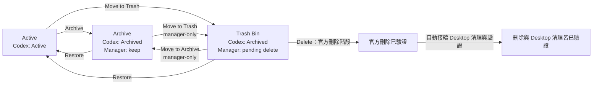

# Agent Session Manager

[English](README.md) | **繁體中文**

Agent Session Manager 是一個 macOS 原生 App，替 Codex 補上一個安全、可批量操作的 session 管理層。

Codex 有 Active 與 Archive，但沒有垃圾桶。當 session 變多時，也沒有方便的批量 Archive、Restore
或刪除流程。更麻煩的是，「我想長期保留」和「我之後想刪掉」在 Codex 裡都只會呈現 Archived，意圖
無法區分。

這個 App 因此把兩件事分開：

- **Archive**：刻意保留的 session。
- **Trash Bin**：已收起、等待之後永久刪除的 session。

> [!WARNING]
> 目前是 Apple Silicon 的 Alpha 測試版，採 ad-hoc signing，尚未經 Apple notarization。執行永久刪除前，
> 請先備份重要 Codex sessions。整合 Delete 與 Desktop 清理已通過小批次本機驗收，不代表所有批次規模
> 或未來 Codex 版本皆已驗證。請查看最後清理結果，只有官方刪除成功不等於完整清理完成。

## 它如何運作

相容性預覽 build 16 提供 Codex 更新偵測、明確變更提醒、15 組環境快取與 CLI 隔離相容性測試；
**尚未自動放行未知 Desktop 版本的殘留清理**。請先保留目前 Codex 版本，依
[更新測試手冊](docs/USER_GUIDE.md#build-16更新前後的精簡驗收)完成更新前後比對；這次不必刪除真實對話。



Archive 和 Trash Bin 在 Codex 原生狀態中都仍是 Archived。App 自己的 SQLite 只記錄「保留」或
「待刪」的管理意圖與操作報告；Codex 的實際 lifecycle 狀態仍以官方 App Server 的即時 inventory
與 readback 為準。

**Delete 已包含 Ghost 清理**：從 Trash Bin 執行官方刪除後，ASM 會針對同一批成功刪除的 ID，
自動接續 Desktop 殘留檢查與清理。請依提示保持 Codex 與其他使用資料庫的程式關閉；App 會先驗證備份，
再修改 Desktop 資料並核對結果。後段若被阻擋或失敗，報告會明確顯示 Desktop 清理未確認，不會重送 Delete。

獨立的 **Bulk Ghost Delete** 用來處理舊版或其他刪除方式留下的殘留。只有「當下本機正式對話資料不存在」
與「官方精確讀取確認不存在」同時成立才判定為 Ghost；無法確認或不支援的項目保留。
全域設定清理仍需另外查看 diff 並確認；備份也另行保留。

**Deleted 是 ASM 歷史，不是可還原的分類。** 其中的 Archive、Restore 與 Delete 均停用。
Clear Selected Records 或 Clear All List Records 可移除選取或全部清單項目，包括缺少成功報告的舊紀錄，
重新整理或重開後不會再顯示。操作報告與復原證據另行保留，Clear Completed Operation History
只清理完整成功的群組。清除清單不會修改 Codex 或備份，也不等於抹除所有 ASM 資料。
操作方式見[手冊](docs/USER_GUIDE.md)，已驗證範圍與限制見[驗收狀態](docs/VALIDATION.md)。

## 目前能做什麼

- 瀏覽 Codex Live sessions，依狀態、Project、Trust Folder 或 Working Folder 篩選。
- 列表顯示 **Conversation Size**（對話檔大小），可由大到小或由小到大排序。背景加總 `sessions` 與 `archived_sessions` 中同 ID 的新舊對話檔，快取到下次重新整理；尚未計算或無法確認時顯示「—」。不包含專案、共用資料庫與 ASM 備份／報告，也不代表刪除後一定能釋放的空間。Deleted 顯示目前剩餘檔案大小，不沿用刪除前數字。
- 補入 Codex 0.153.4 官方清單漏列、但仍可依 ID 讀取的對話，顯示核對後的來源標籤；這個標籤不代表對話已停用或是 Ghost。
- 使用 checkbox 精確多選並批量 Archive、Restore、移入／移出 Trash Bin。
- 各分類輸入搜尋文字後可用 **Select all search results** 全選目前顯示的結果；沒有搜尋時，只有 Trash Bin 提供 **Select all filtered**。其他已勾選項目保持不變。
- 從 Trash Bin 建立精確的批次刪除；Archive 不能直接刪除，必須先移到 Trash Bin。
- 官方 Delete 後自動接續 Desktop 殘留清理與驗證；未完成的清理會另外標示。
- 可移除選取或全部 Deleted 清單項目，不影響受保護的操作報告與復原證據。
- 以「當下本機state缺席＋官方精確讀取缺席」的deterministic規則盤點並分類Codex Desktop ghosts；
  使用者已完成矩陣所列範圍的 App 清理，無法驗證的殘留維持 blocked。
- 顯示 pinned、running、current 與 descendant protection evidence；不把 unknown 假裝成 clear，並依
  每種操作的安全規則決定是否允許執行。
- 保存逐筆 Report History 與有保留上限的本機 Diagnostic Logs。欄位過濾不等於匿名化；紀錄仍可能包含 session ID、路徑與錯誤細節。
- 記住 sidebar、inspector 與 session table 欄寬。

目前只支援 **Codex Live**。Provider 架構保留給未來的 Claude 或其他 agent systems，但不假設它們
具有和 Codex 相同的 archive／delete semantics。

## 操作畫面

在 **Active** 精確選取 session，再確認可用的 lifecycle 操作：


在 **Archive** 中，可以重新檢查保留的 session，或將它 Restore 回 Active：


只有已歸類到 **Trash Bin** 的 session，才能被選取並執行永久刪除：


以上畫面已遮罩 session 標題、ID、專案名稱與本機路徑。

## 安全模型

每次 mutation 都遵循同一條路徑：

```text
Exact selection → Frozen Preview → Confirm → Execute once → Fresh readback → Itemized Report
```

- Preview 後 inventory 或 protection evidence 漂移，整批 fail closed。
- Provider 回傳 failure 或 unknown 時停止 batch；不會縮小選取範圍後偷偷繼續，也不會自動重送。
- 可逆操作只需要 review Preview 並按下 Confirm。
- Permanent Delete、清除 Report History 要求輸入 exact confirmation token；Ghost清除使用一次按鈕確認，由App綁定該批內部憑證。
- Delete 只接受 Trash Bin 中的 session；只有 **Deletion and Desktop cleanup verified** 代表兩段都已驗證。
  小批次重開後核對已通過，同等大量規模的 App 實機驗收仍未完成。

更完整的規則見 [Safety](docs/SAFETY.md) 與 [Architecture](docs/ARCHITECTURE.md)。

## 下載與安裝

這是以本機 DMG 使用為主的開源專案，不要求公開發行二進位版本。可用下方指令自行打包；
[Releases](https://github.com/xLuSean/agent_session_manager/releases) 的舊產物不一定是最新本機版本。
計算 DMG 的校驗值，與打包時輸出的 SHA-256 比對：

```bash
shasum -a 256 dist/Agent-Session-Manager-0.1.3-streamlined-20260909-arm64.dmg
```

開啟 DMG，將 `AgentSessionManager.app` 拖到 Applications。由於目前版本尚未 notarize，macOS
Gatekeeper 可能阻止一般啟動；若無法開啟，可先改用下方的 Xcode 開發方式。

需求：macOS 14 或更新版本、Apple Silicon，以及本機可用的 Codex CLI／App Server。

## 開發與驗證

用 Xcode 開啟：

```bash
open macos/AgentSessionManager/App/AgentSessionManager/AgentSessionManager.xcodeproj
```

選擇 shared `AgentSessionManager` scheme 與 `My Mac`，然後 Run。Shipping App 直接進入 Codex Live；
Fixture 只存在獨立 test-support target，不會被連結進正式 App。

執行不會送出 live lifecycle mutation 的本機驗證：

```bash
./scripts/verify.sh
```

建立目前的本機 DMG：

```bash
RELEASE_SUFFIX_OVERRIDE=streamlined-20260909 ./scripts/package_lifecycle_canary_dmg.sh
```

輸出位於 `dist/Agent-Session-Manager-0.1.3-streamlined-20260909-<architecture>.dmg`，不在 dist 放獨立 App。
後續打包可用其他 `RELEASE_SUFFIX_OVERRIDE` 區分。完整流程與 signing／notarization 門檻
見 [開發指南](docs/DEVELOPMENT.md)。

## 本機資料

Manager-owned SQLite 與診斷記錄位於：

```text
~/Library/Application Support/com.sean.AgentSessionManager/
```

這些資料用來保存 Trash／Archive 意圖、Preview、Report History 與 bounded diagnostic logs，不取代
Codex 的 session storage，也不是 mutation 成功的判定來源。

## 專案狀態

build 10 已完成本機使用驗收：既有 Ghost 清理、官方 Delete 接續 Desktop 清理，以及可選的全域設定 diff 清理。
build 11 新增獨立的 Deleted 清單移除，並停用 Deleted 的對話操作。核心與 App 測試通過，新清單操作仍待使用者人工驗收；備份另行保留。

目前交付為 Apple Silicon、ad-hoc 簽署的本機 DMG，不是經 Apple 公證的公開二進位版本。小批次 App 實測、歷史手動 125 筆清理與 148／500 筆隔離測試是不同證據，不能宣稱新版 App 的同等大量實機驗收也已完成。版本與精確限制見[驗收狀態](docs/VALIDATION.md)，操作見[手冊](docs/USER_GUIDE.md)，其他工程文件見[文件入口](docs/README.md)。

## Security 與 License

請勿在公開 Issue 貼出未遮罩的 session ID、專案名稱、本機路徑、SQLite、JSONL 或 diagnostic logs。
漏洞回報方式見 [SECURITY.md](SECURITY.md)。

本專案採 [Apache License 2.0](LICENSE)，作者與 attribution 資訊見 [NOTICE](NOTICE)。

## 文件

目前產品狀態、工程契約、建置與測試說明，以及選讀的歷史背景，統一由[文件導覽](docs/README.md)進入。
